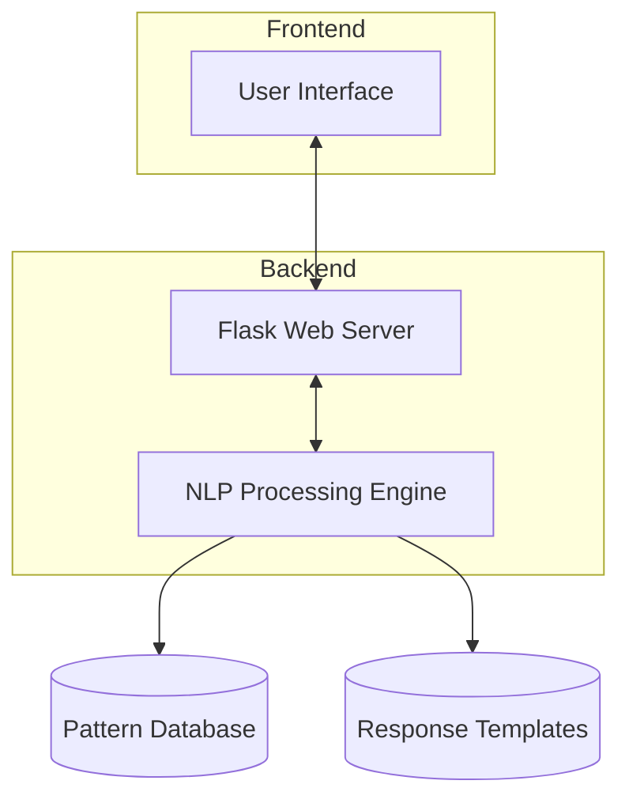
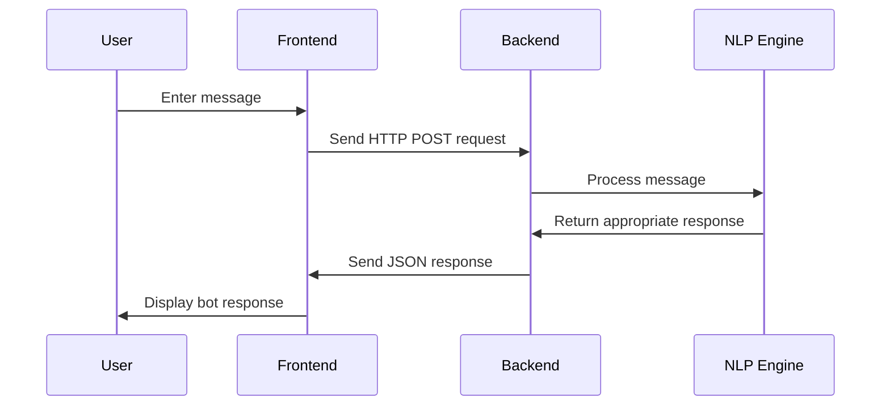
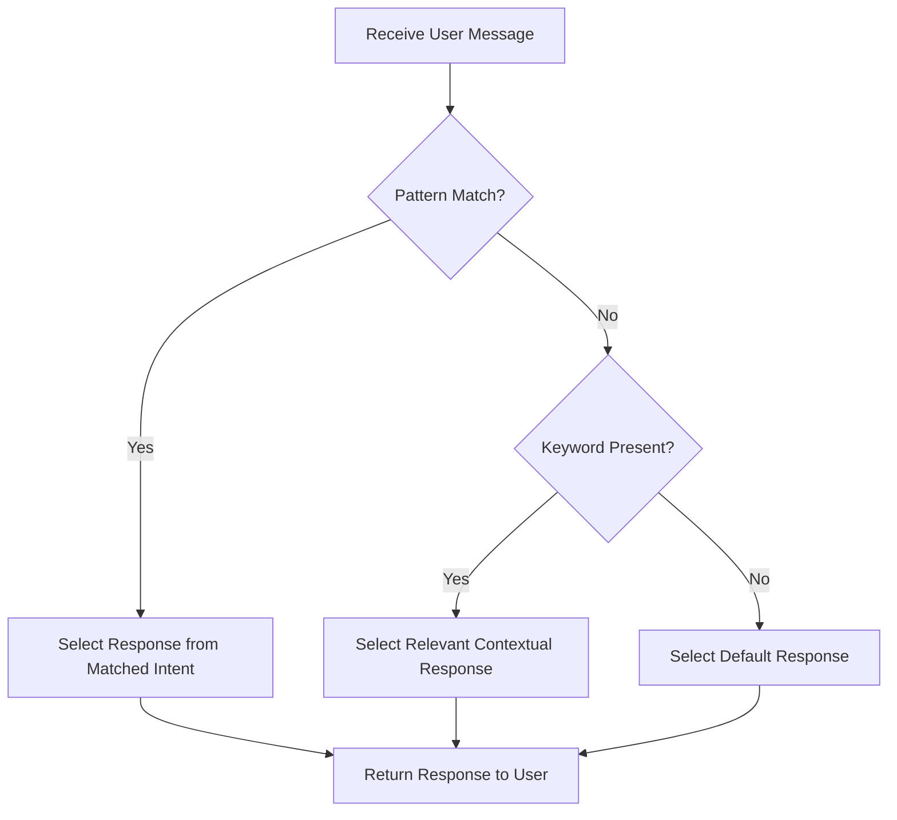
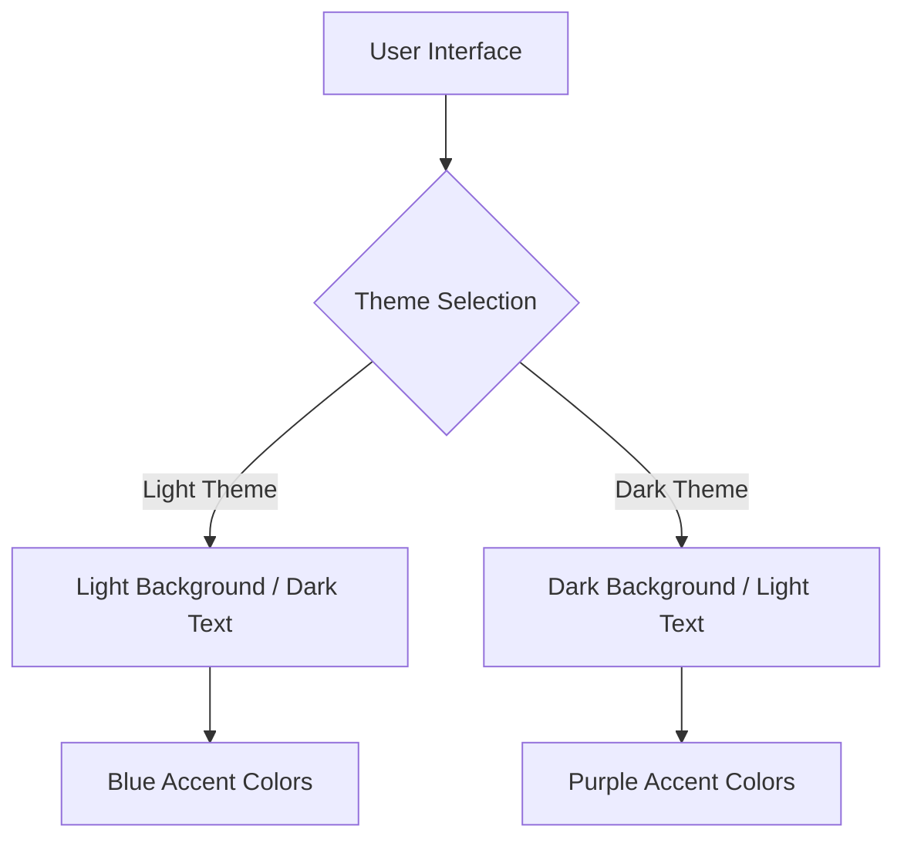
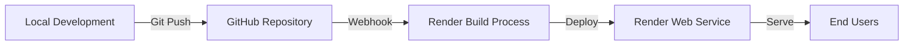

# NLP Chatbot Application


## Project Overview

This NLP Chatbot Application is a web-based conversational agent built with Python, Flask, and natural language processing techniques. The chatbot provides an intuitive user interface for interactive conversations, responding to user queries using pattern matching and context-based response generation.

**Live Demo:** [https://chatbot-app-d9i6.onrender.com/](https://chatbot-app-d9i6.onrender.com/)  
**Repository:** [https://github.com/Ismat-Samadov/chatbot_app](https://github.com/Ismat-Samadov/chatbot_app)

## Table of Contents

- [Features](#features)
- [Architecture](#architecture)
- [Technology Stack](#technology-stack)
- [Implementation Details](#implementation-details)
- [Installation and Setup](#installation-and-setup)
- [Usage Guide](#usage-guide)
- [Code Structure](#code-structure)
- [Pattern Matching System](#pattern-matching-system)
- [Response Generation](#response-generation)
- [UI/UX Design](#uiux-design)
- [Deployment](#deployment)
- [Future Enhancements](#future-enhancements)
- [Lessons Learned](#lessons-learned)
- [Contributors](#contributors)
- [License](#license)

## Features

- **Real-time Conversation:** Instant messaging interface with dynamic responses
- **Pattern Recognition:** Identifies user intents through regex pattern matching
- **Context-based Responses:** Generates appropriate replies based on identified topics
- **Dark/Light Theme Toggle:** User-customizable interface appearance
- **Responsive Design:** Fully functional across desktop and mobile devices
- **Typing Indicators:** Visual feedback when the chatbot is "thinking"
- **Timestamp Display:** Shows the time each message was sent
- **Simple Deployment:** Easy to deploy on cloud platforms like Render

## Architecture

The application follows a client-server architecture with the following components:



### Data Flow



## Technology Stack

### Frontend
- **HTML5/CSS3:** Page structure and styling
- **JavaScript (ES6+):** Client-side interactivity
- **Font Awesome:** Icons for user interface elements
- **Google Fonts (Poppins):** Typography

### Backend
- **Python 3.x:** Server-side programming
- **Flask:** Web framework
- **Regular Expressions:** Pattern matching for intent recognition
- **Random module:** Response variation for natural conversation
- **JSON:** Data exchange format

### Deployment
- **Render:** Cloud platform hosting
- **Git/GitHub:** Version control and source code management
- **Gunicorn:** WSGI HTTP Server for production

## Implementation Details

### NLP Processing Approach

The chatbot employs a rule-based approach to natural language processing:

1. **Intent Recognition:** Uses regular expressions to match user inputs with predefined patterns
2. **Response Selection:** Chooses appropriate responses from categorized templates
3. **Contextual Analysis:** Identifies specific keywords to provide topic-relevant replies
4. **Default Handling:** Provides general responses when no specific pattern is matched

This approach provides a foundation for conversational interaction while remaining lightweight and efficient for web deployment.

## Installation and Setup

### Prerequisites
- Python 3.7 or higher
- pip (Python package manager)
- Git (optional, for cloning the repository)

### Local Installation

1. Clone the repository:
   ```bash
   git clone https://github.com/Ismat-Samadov/chatbot_app.git
   cd chatbot_app
   ```

2. Create and activate a virtual environment:
   ```bash
   python -m venv venv
   
   # On Windows
   venv\Scripts\activate
   
   # On macOS/Linux
   source venv/bin/activate
   ```

3. Install dependencies:
   ```bash
   pip install -r requirements.txt
   ```

4. Run the application:
   ```bash
   python app.py
   ```

5. Open your browser and navigate to:
   ```
   http://localhost:8080
   ```

## Usage Guide

### Starting a Conversation

1. Open the chatbot application in your web browser
2. The chatbot will greet you with a welcome message
3. Type your message in the input field at the bottom
4. Press Enter or click the send button to submit

### Example Interactions

- **Greetings:** "Hi", "Hello", "Hey there"
- **Questions about the bot:** "Who are you?", "What can you do?"
- **Topic-specific queries:** "Tell me about Python", "What's this course about?"
- **Closing the conversation:** "Goodbye", "Thanks", "Bye"

### Theme Toggle

Click the moon/sun icon in the top-right corner to switch between light and dark themes.

## Code Structure

The project follows a clear organization pattern:

```
chatbot_app/
│
├── app.py                  # Main Flask application
├── requirements.txt        # Python dependencies
├── .gitignore              # Git ignore rules
├── LICENSE                 # MIT License
│
├── static/                 # Static assets
│   ├── style.css           # CSS styling
│   └── script.js           # Client-side JavaScript
│
└── templates/              # HTML templates
    └── index.html          # Main page template
```

## Pattern Matching System

The chatbot uses regular expressions to identify user intents:

```python
patterns = {
    "greeting": r"(?i)^(hi|hello|hey|greetings|good (morning|afternoon|evening)).*",
    "goodbye": r"(?i)^(bye|goodbye|see you|farewell|exit|quit).*",
    "thanks": r"(?i)^(thanks|thank you|appreciate it|grateful).*",
    "how_are_you": r"(?i)^(how are you|how('s| is) it going|what('s| is) up|how do you do).*",
    "who_are_you": r"(?i)^(who are you|what are you|tell me about yourself|introduce yourself).*",
    "capabilities": r"(?i)^(what can you do|what are your capabilities|help|functions|features).*"
}
```

Key features of this system:
- **Case insensitivity:** Using `(?i)` flags
- **Pattern alternatives:** Pipe operator `|` for multiple matching options
- **Grouping:** Parentheses to organize complex patterns
- **Beginning of string:** `^` anchor to match from the start
- **Wildcards:** `.*` to allow any text after the pattern

## Response Generation

Responses are organized by intent categories:

```python
responses = {
    "greeting": ["Hello!", "Hi there!", "Greetings!", "Hey, how can I help?"],
    "goodbye": ["Goodbye!", "See you later!", "Bye!", "Take care!"],
    "thanks": ["You're welcome!", "Glad I could help!", "No problem!", "Anytime!"],
    "how_are_you": ["I'm doing well, thanks for asking!", "I'm good! How about you?", "I'm fine, how can I help?"],
    "who_are_you": ["I'm a simple chatbot built with Python and Flask.", "I'm your AI assistant, how can I help?"],
    "capabilities": ["I can answer simple questions and have basic conversations.", "I'm a basic chatbot that can respond to various prompts."],
    "default": ["I'm not sure I understand. Could you rephrase that?", "Interesting. Tell me more.", "I'm still learning. Could you elaborate?"]
}
```

The process flow for generating responses:



## UI/UX Design

### Design Philosophy

The chatbot interface was designed with the following principles:
- **Simplicity:** Clean layout focusing on the conversation
- **Familiarity:** Chat interface patterns users recognize
- **Accessibility:** Clear typography and contrasting colors
- **Responsiveness:** Adaptable to different screen sizes
- **Visual Feedback:** Typing indicators and message animations

### Theme Options



### Responsive Breakpoints

- **Desktop:** 800px max-width container
- **Tablet:** 768px responsive adjustments
- **Mobile:** 480px further optimizations

## Deployment

The application is deployed on Render, a cloud platform that simplifies web service hosting.

### Deployment Process

1. **Repository Setup:** Code pushed to GitHub repository
2. **Render Configuration:**
   - Connected to GitHub repository
   - Set Python environment
   - Specified build command: `pip install -r requirements.txt`
   - Set start command: `gunicorn app:app`
3. **Environment Configuration:**
   - Set PORT environment variable
4. **Deployment Trigger:** Automatic deployment on main branch updates

### Deployment Architecture



## Future Enhancements

The current implementation provides a foundation that can be extended in several ways:

### Short-term Improvements
- **Extended vocabulary:** Add more patterns and responses
- **Session management:** Remember conversation context
- **User feedback system:** Collect ratings on response quality

### Medium-term Features
- **Integration with transformer models:** Implement Hugging Face transformers
- **Multi-language support:** Add capability for different languages
- **Voice input/output:** Add speech recognition and synthesis

### Long-term Vision
- **Machine learning pipeline:** Train on conversation data
- **API integrations:** Connect to weather, news, or other services
- **Personalization:** Learn user preferences over time

## Lessons Learned

### Technical Insights
- **Pattern matching limitations:** Simple regex patterns work for basic intents but struggle with complex queries
- **Frontend-backend communication:** Handling asynchronous requests properly
- **Deployment considerations:** Environment configuration for cloud platforms

### Project Management
- **Scope definition:** Starting with a minimal viable product
- **Feature prioritization:** Building core functionality first
- **Documentation importance:** Maintaining clear explanations of code functionality

## Contributors

- **Ismat Samadov** - Initial work and maintainer

## License

This project is licensed under the MIT License - see the [LICENSE](LICENSE) file for details.

```
MIT License

Copyright (c) 2025 Ismat-Samadov

Permission is hereby granted, free of charge, to any person obtaining a copy
of this software and associated documentation files (the "Software"), to deal
in the Software without restriction, including without limitation the rights
to use, copy, modify, merge, publish, distribute, sublicense, and/or sell
copies of the Software, and to permit persons to whom the Software is
furnished to do so, subject to the following conditions:

The above copyright notice and this permission notice shall be included in all
copies or substantial portions of the Software.

THE SOFTWARE IS PROVIDED "AS IS", WITHOUT WARRANTY OF ANY KIND, EXPRESS OR
IMPLIED, INCLUDING BUT NOT LIMITED TO THE WARRANTIES OF MERCHANTABILITY,
FITNESS FOR A PARTICULAR PURPOSE AND NONINFRINGEMENT. IN NO EVENT SHALL THE
AUTHORS OR COPYRIGHT HOLDERS BE LIABLE FOR ANY CLAIM, DAMAGES OR OTHER
LIABILITY, WHETHER IN AN ACTION OF CONTRACT, TORT OR OTHERWISE, ARISING FROM,
OUT OF OR IN CONNECTION WITH THE SOFTWARE OR THE USE OR OTHER DEALINGS IN THE
SOFTWARE.
```